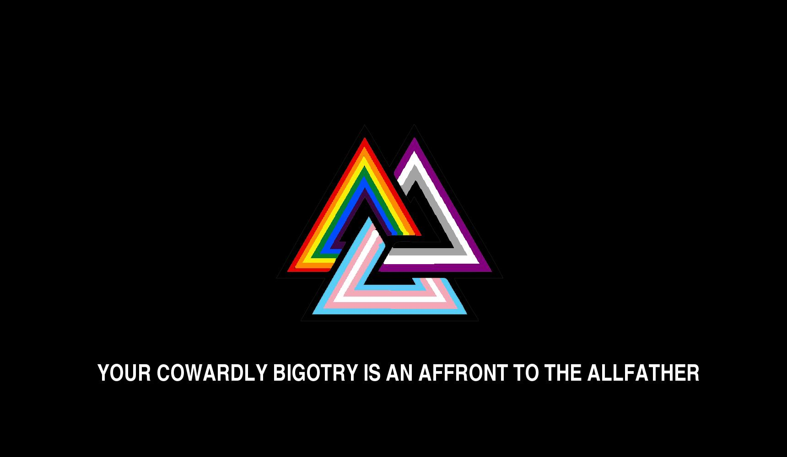

# rainbow-valknuts

This is a tiny web app for generating rainbow [valknuts](https://en.wikipedia.org/wiki/Valknut), based on an idea in [a tweet by @KlezmerGryphon](https://twitter.com/KlezmerGryphon/status/1173897515843735553):

> Hey, Nazis, I got a message for ya from Odin.
>
> 

It uses some code I wrote last year for [drawing with triangular coordinates in SVG](https://alexwlchan.net/2019/09/triangular-coordinates-in-svg/), then randomly selects three flags to mash up into an image.

The flag definitions are taken from the [QueerJS website](https://queerjs.com/flags).

The app is running at <https://rainbow-valknuts.glitch.me>, and the source code is [on GitHub](https://github.com/alexwlchan/rainbow-valknuts).


## Usage

Clone this repository, then run `start.sh`.
This will install dependencies, then start the app running on <http://localhost:5000>:

```console
$ git clone https://github.com/alexwlchan/rainbow-valknuts.git
$ cd rainbow-valknuts
$ ./start.sh
```

You need Python 3 installed.


## License

MIT.
